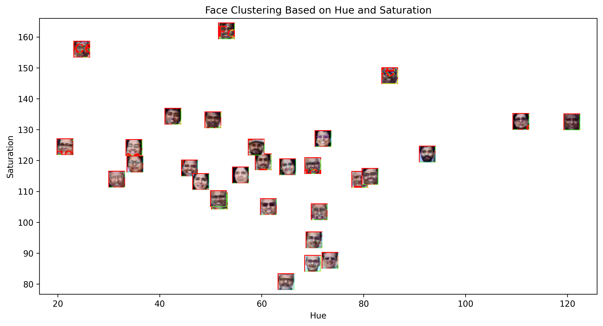

# distance_classification

## Kaggle Experimentation Results

### Detected Faces  

### Face Clustering Based on Hue and Saturation  

### Detected Faces in template

### Template Image Cluster Assignment

### Final Clustered Face Analysis with Template

*Report: Distance-Based Classification Algorithms*

### 1. What are the common distance metrics used in distance-based classification algorithms?

The most commonly used distance metrics include:

- Euclidean Distance
- Manhattan Distance (Taxicab or City Block Distance)
- Minkowski Distance
- Cosine Distance
- Hamming Distance
- Mahalanobis Distance

### 2. What are some real-world applications of distance-based classification algorithms?

- Medical Diagnosis
- Image Recognition
- Recommender Systems
- Anomaly Detection
- Text Mining and NLP
- Handwriting Recognition

### 3. Explain various distance metrics.

- **Euclidean Distance**:
  \[ d(p, q) = \sqrt{\sum_{i=1}^{n} (q_i - p_i)^2} \]
  - Best for continuous numerical data.

- **Manhattan Distance**:
  \[ d(p, q) = \sum_{i=1}^{n} |q_i - p_i| \]
  - Suitable for grid-based environments.

- **Minkowski Distance**:
  \[ d(p, q) = \left( \sum_{i=1}^{n} |q_i - p_i|^p \right)^{1/p} \]
  - Adjusts between Euclidean (p=2) and Manhattan (p=1).

- **Cosine Similarity**:
  \[ \text{similarity} = \frac{A \cdot B}{||A|| ||B||} \]
  - Measures angle-based similarity instead of distance.

- **Hamming Distance**:
  \[ d(p, q) = \sum_{i=1}^{n} I(p_i \neq q_i) \]
  - Works well for binary or categorical data.

- **Mahalanobis Distance**:
  \[ d(p, q) = \sqrt{(p - q)^T S^{-1} (p - q)} \]
  - Accounts for variable correlations.

### 4. What is the role of cross validation in model performance? 
Cross-validation is crucial for assessing model performance by dividing the dataset into training and testing subsets. The key benefits include:

- Avoids Overfitting
- Improves Model Selection by allowing comparison between different hyperparameter settings.
- Reduces Bias and Variance

### 5. Explain variance and bias in terms of KNN?
Bias and variance are two fundamental sources of error in machine learning models:

- **Bias**:
  - Represents the error introduced by approximating a complex function with a simpler model.
  - High bias in KNN occurs when K is too large, leading to oversmoothing and underfitting.

- **Variance**:
  - Measures the sensitivity of the model to small fluctuations in the training data.
  - High variance in KNN occurs when K is too small, leading to overfitting and excessive sensitivity to noise.

A well-chosen K balances bias and variance, often selected through cross-validation.
Typically, a moderate value of K (5-10) provides a good balance.
